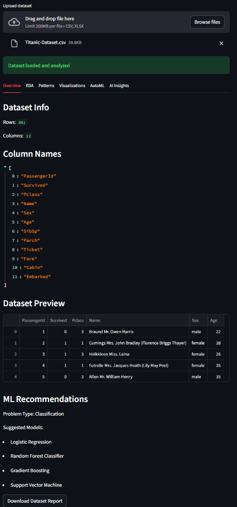
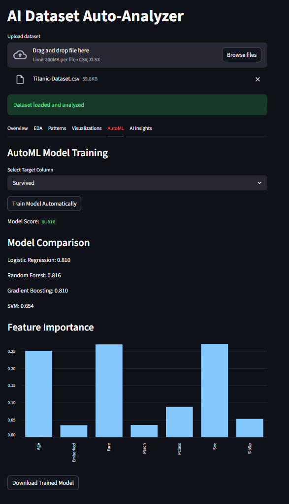
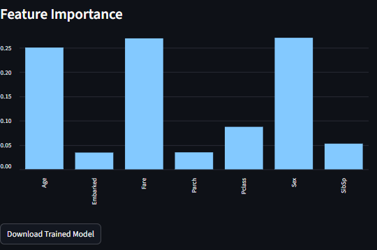

# AI Dataset Auto-Analyzer

<p align="center">

</p>

<p align="center">

<a href="https://ai-dataset-auto-analyzer.streamlit.app/">

</a>


</p>

---

# Live Demo

🚀 Try the application

https://ai-dataset-auto-analyzer.streamlit.app/

---

# Overview

Exploratory Data Analysis (EDA) takes significant time during the data science workflow.

This project automates dataset understanding using **Machine Learning and Large Language Models**.

The system automatically:

- Analyzes dataset structure
- Detects correlations and patterns
- Recommends ML models
- Trains models automatically
- Generates dataset insights
- Supports natural language questions

All results appear in an **interactive Streamlit dashboard**.

---

# Features

## Automated Dataset Analysis

- Upload CSV or Excel datasets
- Automatic EDA
- Detects:
  - Numeric features
  - Categorical features
  - Missing values
  - Correlations
  - Dataset statistics

---

## Pattern Detection

Automatically detects:

- Possible target variable
- Class imbalance
- Feature relationships
- Dataset structure insights

---

## Interactive Visualizations

Powered by **Plotly and Streamlit**

Includes:

- Correlation heatmap
- Feature distributions
- Dataset statistics
- Feature importance charts

---

## AutoML Model Training

Automatically:

- Selects target column
- Splits dataset
- Tests multiple models
- Selects best performing model

Models compared:

- Logistic Regression
- Random Forest
- Gradient Boosting
- Support Vector Machine

Outputs:

- Best model
- Accuracy score
- Feature importance

---

## Natural Language Dataset Q&A

Example questions:

```
How many rows are in the dataset?
Which feature is most important?
What type of problem is this dataset?
```

The AI assistant answers using dataset metadata.

---

## Hybrid LLM Architecture

| Environment | LLM |
|-------------|-----|
| Local Development | Ollama |
| Cloud Deployment | Groq API |

Advantages:

- Offline local development
- Fast cloud inference
- Flexible LLM integration

---

# System Architecture

```
User
 │
 ▼
Streamlit Dashboard
 │
 ▼
Dataset Loader
 │
 ▼
Dataset Analyzer
 │
 ▼
Pattern Detection Engine
 │
 ▼
ML Recommendation Engine
 │
 ▼
Visualization Engine
 │
 ▼
AutoML Trainer
 │
 ▼
LLM Client
 ├── Ollama (Local)
 └── Groq API (Cloud)
```

---

# Project Structure

```
AI_Dataset_Auto_Analyzer
│
├── app
│   └── streamlit_app.py
│
├── core
│   ├── dataset_loader.py
│   ├── dataset_analyzer.py
│   ├── pattern_detector.py
│   ├── ml_recommender.py
│   ├── visualization_engine.py
│   └── automl_trainer.py
│
├── llm
│   ├── llm_client.py
│   ├── qa_engine.py
│   ├── insight_engine.py
│   └── prompt_builder.py
│
├── utils
│   └── report_generator.py
│
├── config
├── requirements.txt
└── README.md
```

---

# Installation

Clone repository

```bash
git clone https://github.com/Aditya-227/AI_Dataset_Auto_Analyzer.git
```

Navigate to project

```bash
cd AI_Dataset_Auto_Analyzer
```

Create virtual environment

```bash
python -m venv venv
```

Activate environment

Windows

```bash
venv\Scripts\activate
```

Linux / Mac

```bash
source venv/bin/activate
```

Install dependencies

```bash
pip install -r requirements.txt
```

---

# Run Application

```bash
streamlit run app/streamlit_app.py
```

Open

```
http://localhost:8501
```

---

# API Setup (Groq)

Create API key

```
https://console.groq.com/
```

Windows

```bash
set GROQ_API_KEY=your_key_here
```

Linux / Mac

```bash
export GROQ_API_KEY=your_key_here
```

---

# Deployment

1 Push code to GitHub  
2 Open

```
https://share.streamlit.io
```

3 Deploy using

```
app/streamlit_app.py
```

4 Add secret

```
GROQ_API_KEY = "your_key"
```

---

# Screenshots







---

# Future Improvements

- Dataset chat interface
- Feature engineering suggestions
- SHAP explainability
- Hyperparameter tuning
- PDF report export

---

# Author

Aditya Verma

GitHub

```
https://github.com/Aditya-227
```

---

⭐ If you like this project, give it a star on GitHub.
